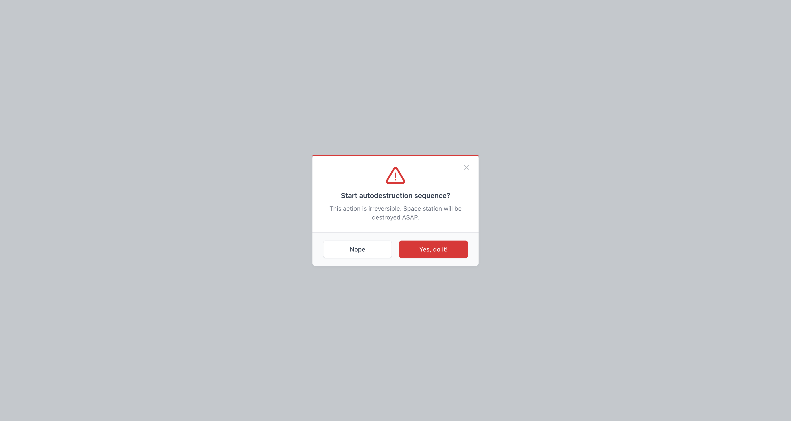
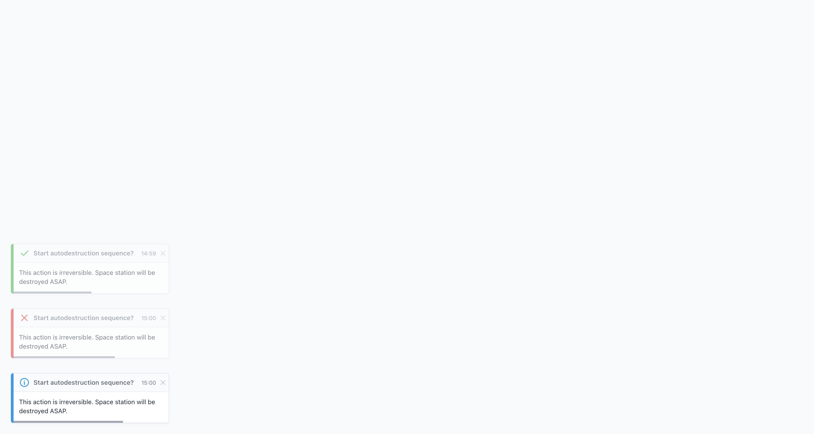

# Vue Confirm Modal

[](https://github.com/vitek-dev/vue-tabler-modals/actions/workflows/publish.yml)
[](https://www.npmjs.com/package/@vitekdev/vue-tabler-modals)
[](https://opensource.org/licenses/MIT)

🎮 **[Live Demo](https://vitek-dev.github.io/vue-tabler-modals/)**

## Installation

```bash
npm install @vitekdev/vue-tabler-modals
```

Don't forgot to import styles: `node_modules/@vitekdev/vue-tabler-modals/dist/style.css`

## Dependencies

- [Vue 3](https://vuejs.org/)
- [Pinia](https://pinia.vuejs.org/)
- [Tabler Icons](https://tabler-icons.io/)
- [Tabler Core CSS styles](https://tabler.io/core/)

## Docs

### [Alert Modals](docs/alert/README.md)


### [Confirm Modals](docs/confirm/README.md)


### [Flash Messages](docs/flash/README.md)


