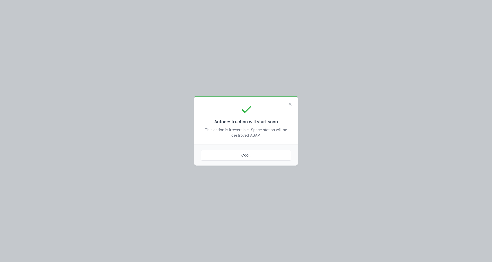

# Alert modal



## Quickstart

### Register Host component in your main App component

```vue
<script setup>
import { AlertModalHost } from '@vitekdev/vue-tabler-modals'
</script>

<template>
  <div>
    <AlertModalHost :default-messages="{ title: 'Something went wrong', description: 'Something is going on here.', confirmLabel: 'OK' }" />
    
    <RouterView />
  </div>
</template>
```

### Usage

```vue
<script setup>
import { AlertModal } from '@vitekdev/vue-tabler-modals'

const showAlert = async () {
  await AlertModal.alert({
    title: 'Alert',
    description: 'This is an alert message.',
    confirmLabel: 'OK'
  })
}
</script>

<template>
  <button @click="showAlert">Show alert</button>
</template>
```